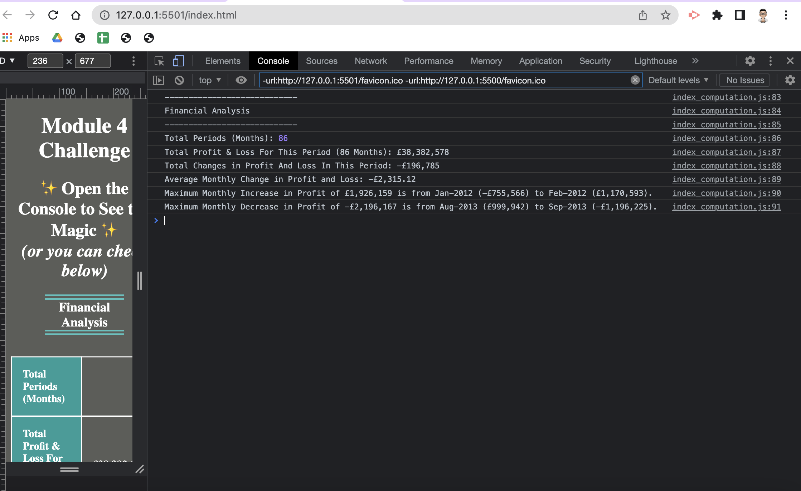

# Console-Finances

## Description

This project is part of the Frontend Dev Bootcamp course challenge for the fourth week "JavaScript Fundamentals". 

It requires us to use JavaScript to analyze a dataset containing profit and loss amounts over time. On first glance, the data consists of 2 columns; Period name (Mmm-YYYY) and profit/loss amount (with positive and negative values). 

The analysis should produce a report containing the certain summaries in the browser's console.

The JScript that produces the output into the browser's console is held in assets/scripts/index_computation.js. This should satisfy this challenge's requiremenmts.

In addition to that, I have created another JScript that displays the summaries and data to the index.hml.  The computations have also been verified to be correct in a spreadsheet ([see PDF](assets/images/data.pdf)).

### Methodology: Pseudo Code
* Find the number of period. On inspection, the data is already sorting chronologically in ascending order. There are also no duplicate months. This means that the number of array elements is the number of period.
* Find the total net profit and loss by adding up all the profit and loss amounts.
* Compute the month to month difference in profit and loss amounts and use these newly computed differentials to compute:
   ** the total of all the changes (A)
   ** average of all the changes (A / number of months - 1)
   ** find the maximum increase in profit and identify the periods (and corresponding profit & loss amounts) with this increase 
   ** find the maximum decrease in profit and identify the periods (and corresponding profit & loss amounts) with this decrease 

### Further Improvements

* Additional data checks such as check for duplicate months etc
* Breakdown the analysis by year.
* Interactive breakdown of the analysis on the frontend

## User Story

AS A new frontend developer
I WANT to display the analysis of profit and loss data given to me in the browser console
SO THAT manaagers can make use of this financial analysis to make decisions.

[Deployment link](https://havetimedrinktea.github.io/Console-Finances/)

## Acceptance Criteria

The webpage must meet the following acceptance criteria:

* Create a GitHub repo "Console-Finances" with the relevant starter files and cloned to local git repo.
    ** Create a JScript to compute the following:
    ** The total number of months included in the dataset.
    ** The net total amount of Profit/Losses over the entire period.
    ** The average of the **changes** in Profit/Losses over the entire period.
    ** The period with the greatest increase in profits (date and amount)
    ** The period with the greatest decrease in profits (date and amount) 

## Table of Contents (Optional)

* [Installation](#installation)
* [Usage](#usage)
* [Credits](#credits)
* [License](#license)
* [Features](#features)
* [Testing](#testing)

## Installation

N.A.

## Usage 

Screen shots of the submitted webpage on different screen sizes:

### Browser Console

### Webpage

## Credits

* mdn web docs especially on formating numbers [toLocalString](https://developer.mozilla.org/en-US/docs/Web/JavaScript/Reference/Global_Objects/Date/toLocaleString)

## License

MIT License

## Features

* Financial analysis to be output to the browswer console.
* Financial values are displayed in the British format with £ as the currency symbol and to the nearest £1. The average profit and loss changes is displayed to the nearest 2 decimal places instead. This is done using a JScript function.
* The same information is displayed on the webpage well.

